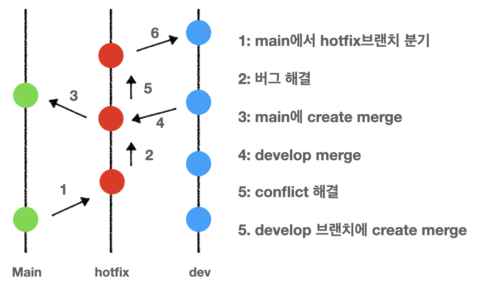

import thumbnail from './img/ambulance.jpeg';
import review from './img/review.png';
import git from './img/git.png';

  

출석 및 출결관리 서비스인 체크메이트를 배포하고 몇가지 긴급하게 수정해야하는 문제가 발생했다. \
첫번째로 모바일(아이폰) 환경에서 위아래 네비게이션 바가 보이지 않는 버그가 있었다.  
두번째로 ATK가 만료되었을 때, 401 상태코드에 대한 에러핸들링이 되지 않아서 그대로 에러페이지를 보여주는 버그가 있었다.

위 버그를 develop 브랜치에서 작업을 해서 merge를 하기에는 이미 개발 중인 기능들이 올라가 있었기 때문에 불가능했다.
각 버그를 차례대로 hotfix 브랜치에서 해결하기로 결정했다.

체크메이트에서 hotfix를 하는 전체 과정은 일반 기능 개발과정과 같다.

  

hotfix이지만 또 다른 실수를 방지하기 위해서 리뷰를 진행하고 Approve가 되었을 시 운영 브랜치에 반영한다.

hotfix를 진행하는 branching 과정은 다음과 같다.

### 레이아웃 버그 hotfix

### 401 에러 핸들링
